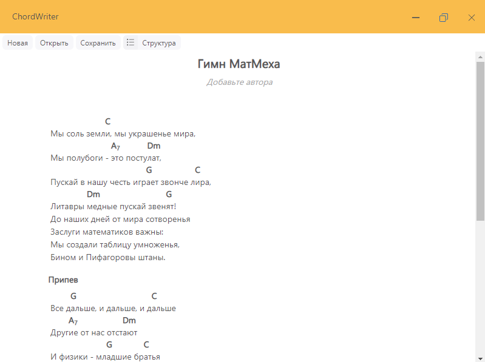

# ChordWriter

Songbooks writing software.

## What is it capable of?

This software is aimed to deliver a WYSIWYG-editor for songs with chords.

For now using ChordWriter you can create, edit, save, load and view songs with chords.

## How to use ChordWriter?

One of basic сoncepts of ChordWriter is a part. ChordWriter sees the song as a couple of part. A part can be a text part with or without chords or instrumental part with only chords.
For now there is no way to add tabs to the songs but it will come soon!

By pressing on button "Структура" you can activate or deactivate structure editing mode. There you can add/remove/rename parts and change their types.
When you are making a new song structure editing mode is active by default.

After adding a part you can start editing it!
Simply click on edit button to begin editing the text or add the chord.
